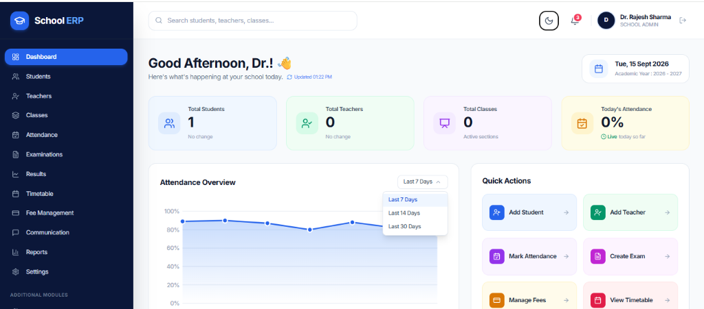

# 🏫 Multi-School Cloud ERP

> A modern, multi-tenant enterprise School Management ERP designed for educational organizations, multi-branch institutions, school administrators, teachers, and students. Built with **React 18, Vite, TypeScript, Tailwind CSS, Node.js, Express, and MongoDB**.

---

## 📸 Screenshots

### 📊 School Admin Dashboard


---

## ✨ Key Features

- **🏢 Multi-Tenant SaaS Architecture:** Isolated tenant databases and logical partitioning ensuring data privacy across multiple schools.
- **🌓 Light & Dark Mode:** Global theme switcher with instant CSS variables sync, automatic system preference detection, and `localStorage` persistence.
- **🛡️ Strict Role-Based Access Control (RBAC):**
  - **Super Admin:** Global platform statistics, tenant management, subscription tracking, and cross-school oversight.
  - **School Admin:** Staff & teacher management, student admissions, attendance, fees collection, examinations, and timetable.
  - **Teacher:** Academic classes, student marks entry, attendance marking, and scheduled timetables.
- **🔑 Flexible Authentication:**
  - Standard Email + Password with password visibility toggle.
  - **Login with OTP (One-Time Password):** Passwordless 6-digit verification with real-time 60s countdown and auto-fill for testing.
  - Offline / Standalone demo fallback session simulation for static frontend deployments (e.g. Vercel).
- **📈 Dynamic & Interactive Analytics:**
  - Real-time attendance curve charts with interactive hover tooltips.
  - Interactive time filter dropdowns (**Last 7 Days**, **Last 14 Days**, **Last 30 Days**).
  - Class-wise student distribution bar charts.
  - Live notice board and upcoming timetable widget.
- **📱 Fully Responsive Design:** Clean mobile-first design with a collapsible navy drawer sidebar, sticky navigation headers, and responsive stat grids.

---

## 🛠️ Tech Stack

### Frontend (`/client`)
- **Framework:** React 18 (TypeScript)
- **Bundler:** Vite 6
- **Routing:** React Router v7
- **Styling:** Tailwind CSS v3 with Dark Mode support
- **Icons:** Lucide React
- **HTTP Client:** Axios with JWT token refresh interceptors

### Backend (`/server`)
- **Runtime:** Node.js (ES Modules)
- **Framework:** Express.js (TypeScript)
- **Database:** MongoDB with Mongoose ODM
- **Authentication:** JSON Web Tokens (Access + Refresh Token rotation), Bcrypt.js
- **Validation:** Zod schema validation
- **Security:** Rate limiting (`express-rate-limit`), CORS, Helmet

---

## 📁 Repository Structure

```text
multi-school-erp/
├── client/                     # Frontend Application
│   ├── src/
│   │   ├── components/         # Reusable UI components (Buttons, Badges, Modals)
│   │   ├── contexts/           # ThemeContext (Light/Dark mode)
│   │   ├── features/auth/      # AuthContext, token management & demo accounts
│   │   ├── layouts/            # DashboardLayout (Sidebar, Navbar, Theme Toggle)
│   │   ├── pages/              # LoginPage, SchoolAdminDashboard, Students, etc.
│   │   ├── routes/             # AppRoutes, ProtectedRoute (RBAC guards)
│   │   └── lib/                # Axios API client & environment config
│   ├── package.json
│   ├── tailwind.config.js
│   └── vite.config.ts
├── server/                     # Backend API
│   ├── src/
│   │   ├── constants/          # Roles, permissions & system constants
│   │   ├── database/           # MongoDB connection & initial seeder
│   │   ├── middlewares/        # AuthMiddleware, TenantCheck, Validation
│   │   └── modules/            # Auth, Schools, Students, Teachers, Staff, Attendance
│   ├── package.json
│   └── tsconfig.json
├── screenshots/                # Application Screenshots
├── vercel.json                 # Vercel Deployment Configuration
└── README.md
```

---

## 🚀 Getting Started

### Prerequisites
- **Node.js:** v18.0.0 or later
- **npm:** v9.0.0 or later
- **MongoDB:** Local instance or MongoDB Atlas connection URI

### 1. Clone the Repository
```bash
git clone https://github.com/priynshu30/multi-school--ERP.git
cd multi-school--ERP
```

### 2. Client Setup
```bash
# Navigate to client folder
cd client

# Install dependencies
npm install

# Start frontend development server
npm run dev
```
The client will start at `http://localhost:5173`.

### 3. Server Setup (Optional for Full Stack)
```bash
# Navigate to server folder
cd ../server

# Install dependencies
npm install

# Configure environment variables
# Copy .env.example to .env and configure MONGODB_URI, JWT_ACCESS_SECRET, etc.
cp .env.example .env

# Start backend server
npm run dev
```
The server will start at `http://localhost:5000/api/v1`.

---

## ☁️ Deployment on Vercel

The frontend is fully configured for deployment on **Vercel** with the included `vercel.json`:

```json
{
  "buildCommand": "cd client && npm install && npm run build",
  "outputDirectory": "client/dist",
  "framework": "vite",
  "rewrites": [
    {
      "source": "/(.*)",
      "destination": "/index.html"
    }
  ]
}
```

### Deploying Steps:
1. Push your changes to GitHub:
   ```bash
   git add -A
   git commit -m "Deploy School ERP"
   git push origin main
   ```
2. Link your GitHub repository in [Vercel](https://vercel.com).
3. If connecting to an external backend, add the environment variable:
   - `VITE_API_URL` = `https://your-backend-api-url.com/api/v1`

---

## 🔒 Security Architecture

- **Brute-Force Defense:** Rate limiting on `/auth/login`, `/auth/send-otp`, and `/auth/verify-otp`.
- **Token Rotation:** Access tokens expire in 15 minutes; refresh tokens rotate automatically on each refresh.
- **Route Isolation:** Unauthenticated requests and unauthorized roles are intercepted and routed to `/login` or `/unauthorized`.
- **Input Sanitization:** Non-numeric characters in OTP verification are filtered, preventing script injections.

---

## 📄 License

This project is licensed under the MIT License - see the LICENSE file for details.
